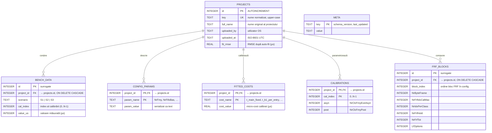

# Diagrama bazei de date — `bench_store.db`

## 1. Context

Aplicația **WoCaSe** persistă rezultatele măsurătorilor de pe stand
(*bench measurements*), configurațiile proiectelor DEM și costurile
micro-operaționale calibrate (*fitted MicroCosts*) într-o bază de date
**SQLite 3** locală, denumită implicit `bench_store.db`. Schema este
implementată în modulul `dem_simulator/bench_store_db.py` și este creată
idempotent la prima conexiune (`CREATE TABLE IF NOT EXISTS`).

Baza de date a fost aleasă pentru a înlocui varianta anterioară bazată
pe un singur fișier JSON. Avantajele soluției actuale, relevante pentru
lucrare, sunt:

- **citiri/scrieri selective** — se încarcă doar proiectul cerut, nu
  întregul magazin;
- **acces concurent prin WAL** (*Write-Ahead Logging*) — mai mulți
  cititori pot interoga simultan în timp ce un proces scrie;
- **indexare nativă B-tree** — căutarea după cheia proiectului este
  $\mathcal{O}(\log n)$;
- **tranzacții atomice** (`BEGIN … COMMIT`) — garantează scrieri
  „totul sau nimic”;
- **zero dependențe externe** — `sqlite3` face parte din biblioteca
  standard Python.

---

## 2. Diagrama entitate-relație (ER)

Diagrama de mai jos a fost generată automat din scriptul
[`generate_er_diagram.py`](generate_er_diagram.py) și este disponibilă
în două formate:

- raster (PNG, 300 DPI) — `images/database_er_diagram.png`
- vectorial (SVG) — `images/database_er_diagram.svg`


> **Regenerare:** după orice modificare a schemei din
> `dem_simulator/bench_store_db.py`, rulați:
>
> ```powershell
> python docs/generate_er_diagram.py
> ```

### Reprezentarea Mermaid (sursă editabilă)

Pentru editare ulterioară a structurii (de ex. adăugarea unui nou
tabel), aceeași diagramă este disponibilă și în notația *crow's foot*
prin sintaxa `erDiagram` din Mermaid. Marcajele atributelor: **PK** =
cheie primară, **FK** = cheie străină, **UK** = constrângere de
unicitate.



> Tabela `META` nu are relații cu celelalte entități: stochează
> metadate globale ale bazei (versiune de schemă, marcaj temporal al
> ultimei actualizări) și este reprezentată independent în partea
> dreaptă a diagramei.

---

## 3. Descrierea entităților

### 3.1 `projects` — entitatea centrală

Reprezintă un proiect DEM unic identificat printr-o cheie normalizată
(`key`), obținută prin `project_name.strip().upper()`. Coloana `id` este
cheia primară de tip *surrogate* (INTEGER PRIMARY KEY = `ROWID`
optimizat), folosită drept referință de toate tabelele copil. Coloana
`key` are constrângere `UNIQUE`, ceea ce împiedică duplicarea
proiectelor și permite operația *upsert* (`ON CONFLICT(key) DO UPDATE`).

Câmpurile `uploaded_by` și `uploaded_at` asigură o trasabilitate minimă
a contribuțiilor într-un context colaborativ de echipă, iar `fit_rmse`
păstrează scorul de eroare al ultimei calibrări automate.

### 3.2 `bench_data` — măsurători de pe stand

Memorează, normalizat, valorile de timp măsurate pe stand pentru fiecare
combinație (scenariu, index de calibrare). Un proiect produce o matrice
$3 \times N$ (3 scenarii standard $\times$ $N$ calibrări), care în
schema relațională devine o mulțime de tuple atomice. Constrângerea
`UNIQUE (project_id, scenario, cal_index)` interzice valori duble
pentru aceeași celulă a grilei WCS.

### 3.3 `config_params` — configurația DEM (EAV)

Folosește modelul **Entity-Attribute-Value (EAV)**: în loc de o coloană
pentru fiecare parametru `ProjectConfig`, există un rând cu numele și
valoarea parametrului. Acest design oferă **extensibilitate**: adăugarea
unui nou câmp în `ProjectConfig` nu impune `ALTER TABLE`. Cheia primară
compusă `(project_id, param_name)` asigură unicitatea parametrilor per
proiect. Distincția numerică (`INT` / `FLOAT`) este recuperată în Python
prin mulțimile `_INT_PARAMS` și `_FLOAT_PARAMS`.

### 3.4 `fitted_costs` — micro-costurile calibrate

Stochează în același stil EAV cele 20 de costuri elementare
`MicroCosts` (în µs) rezultate din optimizarea prin *coordinate descent*
implementată în `simulation.auto_fit()`. Permite reutilizarea costurilor
între rulări fără a relua optimizarea (cost computational ridicat).

### 3.5 `calibrations` — perechi $(N_{asyn},\, N_{post})$

Memorează cele șase perechi standard de calibrare
$(N_\text{ClcFmyEveAsyn},\, N_\text{ClcFmyPost})$ care definesc coloanele
grilei WCS. Cheia primară compusă `(project_id, cal_index)` asigură
ordinea deterministă a calibrărilor și împiedică inserții ambigue.

### 3.6 `frf_blocks` — blocuri Freeze-Frame

Conține parametrii fiecărui bloc FRF al proiectului (în general 4
blocuri pentru proiectele Schaeffler), descriși în lucrare prin
dataclass-ul `FrfBlockConfig`. Spre deosebire de tabelele EAV de mai
sus, aici se folosește o **reprezentare relațională clasică „un câmp →
o coloană”**, deoarece structura este fixă și parametrii fac obiectul
unor calcule numerice frecvente. Coloana `block_index` păstrează ordinea
declarării.

### 3.7 `meta` — metadate globale

Tabelă de tip dicționar (key/value) pentru date administrative:
versiunea schemei (`schema_version`) și marcajul temporal al ultimei
modificări (`last_updated`). Nu participă la relații.

---

## 4. Cardinalități și integritate referențială

Toate relațiile pornesc din `projects` și sunt de tipul **1 : N** (un
proiect → zero sau mai multe rânduri în fiecare tabel copil). Notația
Mermaid `||--o{` indică:

- **„1”** pe partea proiectului (un singur părinte);
- **„0..N”** pe partea copilului (un proiect nou poate exista fără
  măsurători încă încărcate).

Toate cheile străine declară `ON DELETE CASCADE`, iar
`PRAGMA foreign_keys = ON` este activat la fiecare conexiune. Ștergerea
unui proiect (`delete_project()`) declanșează automat ștergerea
înregistrărilor sale din toate tabelele dependente, garantând absența
rândurilor orfane.

---

## 5. Indecși

În plus față de indecșii impliciți generați pentru cheile primare și
constrângerile `UNIQUE`, schema definește șapte indecși expliciți pentru
a accelera interogările frecvente:

| Index                         | Tabel           | Coloane                                |
| :---------------------------- | :-------------- | :------------------------------------- |
| `idx_projects_key`            | `projects`      | `key`                                  |
| `idx_bench_project`           | `bench_data`    | `project_id`                           |
| `idx_bench_proj_scn_cal`      | `bench_data`    | `project_id, scenario, cal_index`      |
| `idx_config_project`          | `config_params` | `project_id`                           |
| `idx_costs_project`           | `fitted_costs`  | `project_id`                           |
| `idx_cal_project`             | `calibrations`  | `project_id`                           |
| `idx_frf_project`             | `frf_blocks`    | `project_id`                           |

Indexul compus `idx_bench_proj_scn_cal` acoperă interogarea esențială
prin care se reconstituie grila WCS în `_load_bench()`, eliminând
scanările secvențiale.

---

## 6. Optimizări la nivel de conexiune

La fiecare deschidere a bazei (`_connect`) sunt aplicate următoarele
setări:

```sql
PRAGMA journal_mode = WAL;        -- permite cititori paraleli
PRAGMA foreign_keys = ON;         -- integritate referențială strictă
PRAGMA synchronous  = NORMAL;     -- (FULL pe partajări UNC)
```

După fiecare *upload* se forțează un checkpoint
(`PRAGMA wal_checkpoint(FULL)`), astfel încât datele să fie scrise din
fișierul `-wal` în fișierul principal `.db`. Aceasta este esențială
atunci când baza este plasată pe o partajare de rețea (UNC), unde alți
clienți trebuie să vadă imediat datele noi.

---

## 7. Justificarea opțiunilor de design

1. **Normalizare 3NF parțială.** Tabelele `projects`, `bench_data`,
   `calibrations` și `frf_blocks` respectă forma normală 3 (atribute
   atomice, fără dependențe tranzitive). Tabelele `config_params` și
   `fitted_costs` adoptă intenționat modelul EAV pentru a accepta
   evoluția schemei de configurare DEM fără migrări costisitoare.

2. **Surrogate keys vs. composite keys.** Pentru tabelele cu volum mare
   sau cu posibile reinserții complete (`bench_data`, `frf_blocks`) s-a
   ales cheie primară surrogate (`INTEGER PRIMARY KEY`) plus o
   constrângere `UNIQUE` separată, pentru a evita fragmentarea indexului
   primar la ștergeri/inserții repetate. Pentru tabelele de tip
   *catalog* (`config_params`, `fitted_costs`, `calibrations`) s-a
   folosit cheie compusă, suficient de selectivă și mai compactă.

3. **Strategia de actualizare „delete + insert”.** Funcțiile
   `_store_*` șterg toate rândurile vechi ale unui proiect înainte de a
   le insera pe cele noi, totul într-o singură tranzacție implicită
   (`with conn:`). Această strategie simplifică logica și păstrează
   atomicitatea, fără riscul de a lăsa în baza de date un mix
   inconsistent între versiuni vechi și noi ale configurației.

4. **Decuplare prin tabela `meta`.** Stocarea versiunii de schemă într-o
   tabelă dedicată permite implementarea ulterioară a unui mecanism de
   *migrații versionate*, fără a afecta structura datelor de business.

---

## 8. Reprezentarea DDL (referință)

Pentru completitudine, codul DDL exact (extras din `_SCHEMA_SQL`) este:

```sql
CREATE TABLE IF NOT EXISTS projects (
    id          INTEGER PRIMARY KEY,
    key         TEXT    UNIQUE NOT NULL,
    full_name   TEXT    DEFAULT '',
    uploaded_by TEXT    DEFAULT '',
    uploaded_at TEXT    DEFAULT '',
    fit_rmse    REAL    DEFAULT 0.0
);

CREATE TABLE IF NOT EXISTS bench_data (
    id          INTEGER PRIMARY KEY,
    project_id  INTEGER NOT NULL REFERENCES projects(id) ON DELETE CASCADE,
    scenario    TEXT    NOT NULL,
    cal_index   INTEGER NOT NULL,
    value_us    INTEGER NOT NULL DEFAULT 0,
    UNIQUE (project_id, scenario, cal_index)
);

CREATE TABLE IF NOT EXISTS config_params (
    project_id  INTEGER NOT NULL REFERENCES projects(id) ON DELETE CASCADE,
    param_name  TEXT    NOT NULL,
    param_value TEXT    NOT NULL DEFAULT '',
    PRIMARY KEY (project_id, param_name)
);

CREATE TABLE IF NOT EXISTS fitted_costs (
    project_id  INTEGER NOT NULL REFERENCES projects(id) ON DELETE CASCADE,
    cost_name   TEXT    NOT NULL,
    cost_value  REAL    NOT NULL DEFAULT 0.0,
    PRIMARY KEY (project_id, cost_name)
);

CREATE TABLE IF NOT EXISTS calibrations (
    project_id  INTEGER NOT NULL REFERENCES projects(id) ON DELETE CASCADE,
    cal_index   INTEGER NOT NULL,
    asyn        INTEGER NOT NULL DEFAULT 0,
    post        INTEGER NOT NULL DEFAULT 0,
    PRIMARY KEY (project_id, cal_index)
);

CREATE TABLE IF NOT EXISTS frf_blocks (
    id              INTEGER PRIMARY KEY,
    project_id      INTEGER NOT NULL REFERENCES projects(id) ON DELETE CASCADE,
    block_index     INTEGER NOT NULL,
    NrByteFrame     INTEGER DEFAULT 0,
    NrFrfIdxCalMax  INTEGER DEFAULT 0,
    NrIdxPerClass   INTEGER DEFAULT 0,
    NrFrfHold       INTEGER DEFAULT 0,
    NrFrfTot        INTEGER DEFAULT 0,
    LfOptions       INTEGER DEFAULT 0
);

CREATE TABLE meta (
    key   TEXT PRIMARY KEY,
    value TEXT
);
```

---

## 9. Concluzie

Schema propusă realizează un compromis echilibrat între **rigoarea
relațională** (cheile primare, cheile străine cu cascadă, constrângerile
de unicitate, indecșii compuși) și **flexibilitatea operațională**
(modelul EAV pentru configurări și costuri, surrogate keys pentru
tabelele cu reinserare frecventă). Combinată cu modul WAL al SQLite,
aceasta oferă o soluție de persistență robustă, ușor portabilă, cu zero
dependențe externe — potrivită atât pentru utilizarea individuală a
inginerului de validare, cât și pentru partajarea colaborativă a
costurilor calibrate la nivel de echipă.
